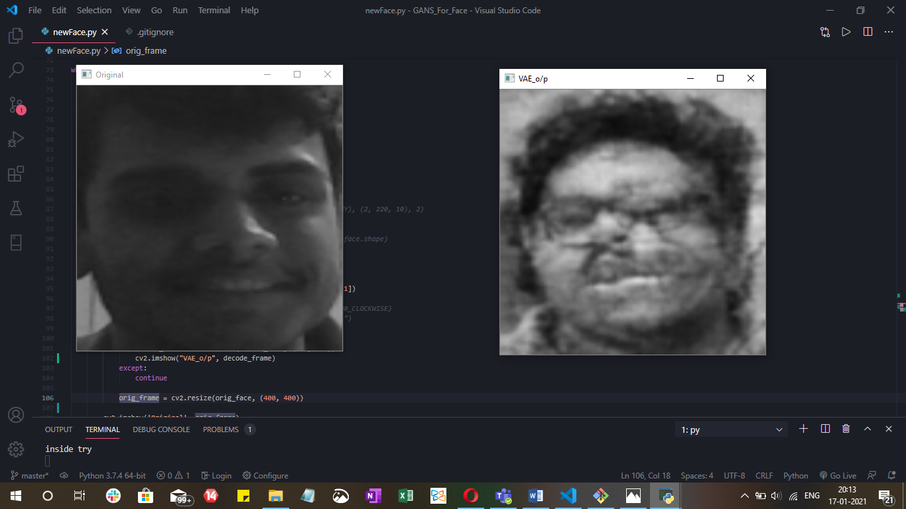

# VAE_Face
<i>A mini-project in which a <b>variational autoencoder</b> is used to generate one of my friend's face by taking a sample face as input</i>

<table>
  <tr>
    <td>You can see in the example picture where on the left a sample image is given the VAE output is shown on the right</td>
  </tr>
  <tr>
    <td></td>
  </tr>
   

 </table>
